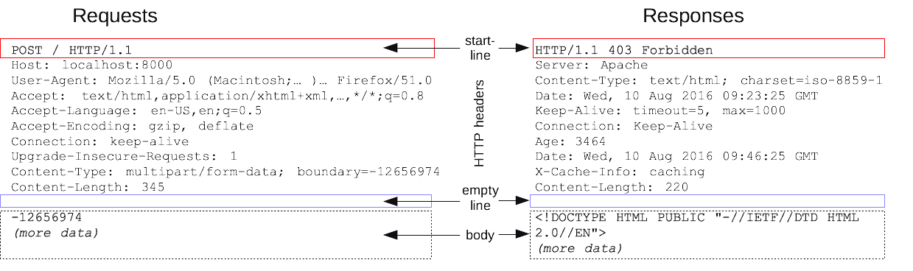
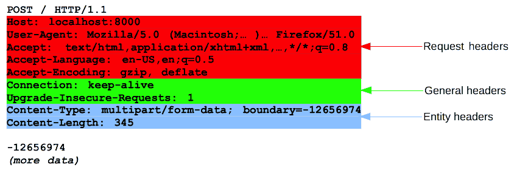

# HTTP (HyperText Transfer Protocol)

하이퍼텍스트를 전송하기 위한 프로토콜이다. 요새는 HTML, TEXT, IMAGE, 음성, 영상, JSON 등 거의 모든 형태의 데이터를 전송한다. 현재 우리가 사용하는 프로토콜은 대부분 HTTP/1.1, 2이며 이는 TCP 프로토콜 위에서 작동한다.

---

### 무상태 프로토콜 (Stateless)

HTTP는 컨택스트가 없는 프로토콜이다. 전에 나눴던 얘기를 전혀 기억하지 못한다는 걸 기억하자. 이는 서버를 스케일 아웃할 때 큰 이점이 된다. 그 이유는 만약 전화와 문자의 차이를 생각해보면 된다.

우리가 점원에게 물건을 산다고 가정하자.이 때 만약 상태가 유지된다면 우리는 원하는 물품을 구매하기 위해 물품명, 갯수, 특징 등을 점원과의 질의응답을 통해 순차적으로 얘기할 것이다. 이것이 상태유지 Stateful이다. 반면 인터넷으로 구매한다면? 어떤 상품을 몇 개, 어떤 옵션으로 구매하는지 한번에 전달하면서 구매한다. 

그렇다면 왜 서버는 무상태를 유지하는 것이 좋은 것일까. 만약 서버를 점원이라고 가정해보자. 이 경우에는 우린 클라이언트의 요구사항을 만족시킬 때까지 동일한 점원(서버)을 유지해야 한다. 만약 바뀐다면 지금까지 전달한 정보들은 무용지물이 되기 때문이다. 

만약 점원이 상태를 유지하지 않는 Statelses 라면? 이야기가 다르다. 그냥 한번에 요구사항을 전달받기만 하면 되는 점원(서버)을 늘리면 끝이다. 상태가 유지되는 것 대비 확실한 장점이 있다. 

---

### 비연결성

우리는 상대방과 통화할 때 시간마다 요금을 지불한다. 클라이언트와 서버의 연결이 전화라고 생각해보자. 서버와 클라이언트는 왜 아니겠는가. 계속 유지되고 있는건 그 시간동안 리소스를 사용하고 있는 것이다.

따라서 우리는 클라이언트가 요구한 사항에 대해 필요한 정보를 한번에 받고 요청을 응답하기 전까지는 연결을 끊어버린다. 이로써 우리는 요청사항이 처리되기 전까지의 시간동안 연결에 필요한 리소스를 효율적으로 절약할 수 있다. 하지만 이런 모델은 아래와 같은 문제가 있다. 

1. TCP/IP 연결을 새로 맺어야 한다. 아까 언급했던 3 way handshake(연결 수립)에 필요한 시간이 추가된다.
2.  웹 브라우저로 사이트를 요청 시 HTML, JS, CSS, IMAGE 등 수많은 자원이 함께 다운로드된다.

우리는 이 문제를 처리하기 위해 HTTP 지속 연결(Persistent Connections)로 문제를 해결했다. 이전에는 각각의 리소스를 다운로드하기 위해 요청을 맺고 끊었다면 이제는 리소스를 모두 내려받기까지는 요청을 유지하고 다운로드가 끝난 후 연결을 종료하는 방법이다. 

---

## HTTP 메시지 구조

HTTP 메시지는 서버와 클라이언트 간에 데이터가 교환되는 수단으로 사용되며 두 가지 타입이 존재한다. *요청 메시지(request message)*는 **클라이언트가 서버로 전달해서 서버의 액션이 일어나게끔 하는 메시지고, *응답 메시지(response-message)*는 *요청 메시지(request-message)*에 대한 서버의 답변이다.

메시지는 ASCII로 인코딩된 텍스트이고 여러 줄로 각자의 역할이 구분되어 있다. 최초의 HTTP 프로토콜과 HTTP/1.1, HTTP/2까지 HTTP 프로토콜은 꾸준히 발전해왔고 대부분 소프트웨어 혹은 브라우저 등이 HTTP 메시지를 사람 대신 작성해준다. 아래는 HTTP 메시지의 구조다.

[https://developer.mozilla.org/ko/docs/Web/HTTP/Messages](https://developer.mozilla.org/ko/docs/Web/HTTP/Messages)

### 1. **start-line**

- 요청(Request)인 경우는 request line이라고 불리며 ***HTTP 메서드 + 요청 타겟 + HTTP Version*** 형식으로 작성된다.
    - Http Method: GET, PUT, POST 등 추후 소개
    - 요청 타겟: 주로 URL, 프로토콜, 포트, 도메인의 절대 경로
        - origin: 가장 일반적인 형식으로 끝에 ‘?’와 쿼리 문자열이 붙는다.
            
            → *ex. GET /background.png HTTP/1.0*
            
        - absolute: 완전한 URL 형식이다.
            
            → *ex.* GET http://developer.mozilla.org/en-US/docs/Web/HTTP/Messages HTTP/1.1
            
        - authority: 도메인 이름 및 옵션 포트가 붙는다. 만약 HTTP 터널을 구축하는 경우 CONNECT와 함께 사용이 가능하다.
            
            → ex. CONNECT developer.mozilla.org:80 HTTP/1.1
            
        - asterisk: OPTIONS와 함께 사용되며, 서버 전체를 나타낸다.
            
            → *ex.* OPTIONS * HTTP/1.1
            
- 응답(Response)인 경우 status line이라고 불리며 ***HTTP Version + Status code + Reason phrase*** 형식으로 작성된다.
    - Status Code: 요청의 성공 여부를 나타낸다.
    - Reason phrase: 상태 코드를 나타내는 설명이다.

### 2. header

[https://developer.mozilla.org/ko/docs/Web/HTTP/Messages](https://developer.mozilla.org/ko/docs/Web/HTTP/Messages)

- HTTP 메시지 전송에 필요한 모든 부가정보(메타데이터)들이 들어있다. 아래는 4가지의 분류다.
    - **General header** : 메시지 전체에 적용되는 정보
        
        *ex. Connection: close*
        
    - **Request header** : 요청 정보
        
        *ex. User-Agent*
        
    - **Response header** : 응답 정보
        
        *ex. Server*
        
    - **Representation header** :  메시지 바디(payload)를 통해서 전달되는 표현 데이터(전달할 실제 데이터)를 해석할 수 있는 정보
        
        *ex. Content-type, Content-length*
        
- 표현 헤더
    - Content-Type: 표현 데이터의 형식
    - Content-Encoding: 표현 데이터의 압축 방식
    - Content-Language: 표현 데이터의 자연 언어
    - Content-Length: 표현 데이터의 길이

### 협상(Content nagotiation)

간단하게는 서버에서 응답을 줄 때 클라이언트가 선호하는 표현에 대한 요청 모음이며 요청시에만 사용한다.

- Accept: 미디어 타입
- Accept-Charset: 문자 인코딩
- Accept-Endcoing: 압축 인코딩
- Accept-Language: 자연 언어

### 캐시

- 캐시는 서버에서 클라이언트에게 동일한 요청을 받았을 때 네트워크를 통한 데이터 전달(클라이언트의 다운로드)에 필요한 리소스를 효율적으로 절약하기 위한 기술이다.
- 서버에서는 캐시 유효 시간을 지정하고 그동안 캐시를 통해 데이터를 전달하는데, 이 때 만약 유효시간이 지나도 전달하는 데이터가 달라지지 않았다면 어떻게 할까. 서버와 클라이언트의 데이터가 변경되지 않았다는 검증만 있다면 우린 만료된 캐시를 다시 사용해도 전혀 지장이 없다. 따라서 우리는 **검증 헤더(Last-Modified)를 추가**하는 것을 통해 데이터의 마지막 수정시각을 전달한다.
- ***캐시 유효 시간이 초과해도 서버의 데이터가 갱신되지 않는다면 둘을 비교해 304 Not Modified***
    - 서버는 자신이 보유하고 있는 데이터의 **최종 수정일(Last-Modified) 헤더**와 클라이언트 요청의 **검증 헤더(if-Modified-Since)를 비교**해 수정점이 없는 경우에는 304 Not Modified 응답을 보낸다. 이 때 데이터가 전달되는 Http Body는 생략하여 리소스를 절약한다. 만약 수정되었다면 Http Body에 데이터를 담아 200 OK를 응답한다.
- **발전된** ***ETag(If-Match, If-None-Match)를 활용한 데이터 동일 검증***
    - if-Modified-Sinse, Last-Modified 헤더를 통한 캐시에는 아래와 같은 단점이 있다.
    - 초단위로 캐시 조정이 불가능하다
    - 날짜 기반의 로직을 사용하기 때문에 데이터가 수정 후 원복되었을 경우를 캐치하지 못한다
    - 서버에서 별도의 캐시 로직을 관리하는 것이 불가능하다
- 따라서 현재는 단순히 수정날짜만 가지고 데이터 전달 여부를 결정하는 것이 아닌  ETag(Entity Tag)라는 고유한 데이터에 임의의 식별자 이름을 부여하는 방식을 사용한다.
    - 위 방법을 통해 변경 여부를 날짜가 아닌 고유 데이터의 식별값(ETag)로만 판단하며, 캐시 제어 로직을 서버에서 완전하게 관리하기 때문에 클라이언트 입장에서는 캐시 메커니즘을 전혀 모르는 블랙박스가 된다.

### 캐시 제어 헤더

- Cache-Control
    - max-age: 캐시 유효 시간, 초 단위
    - no-cache: 데이터는 캐시해도 되지만, 항상 origin 서버에 검증하고 사용
    - no-store: 데이터에 민감한 정보가 있으므로 저장하지 말고 메모리에서 사용한 뒤 최대한 빨리 삭제
    - must-revalidate: 캐시 만료 후 최초 조회 시 origin 서버에 반드시 검증, origin 서버 접근 실패 시 반드시 504 Gateway Timeout 에러가 발생(origin 서버와의 네트워크 문제가 발생할 경우를 대비), 만약 캐시 유효시간이라면 캐시를 사용
    - public: 응답이 public 캐시에 저장되어도 됨
    - private: 개인용이므로 private 캐시로 저장되어야 함
- Pragma
    - no-cache: HTTP 1.0 하위 호환
- Expires
    - 캐시 만료일을 정확한 날짜로 지정한다. 지금은 초단위가 가능한 Cache-Control이 있기 때문에 잘 사용되지 않으며 Cache-Control:max-age와 함께 사용되면 무시된다.
- 캐시 무효화를 하기 위해 꼭 작성해야하는 헤더
    - Cache-Control: no-cache, no-store, must-revalidate
    - Pragma: no-cache

---

### 프록시 캐시

만약 우리가 요청하고자 하는 데이터를 가진 서버가 세계 어딘가 멀리 있다면 어떻게 해야할까. 가만히 기다려야 할까. 그렇게 기다리기엔 시간은 너무나도 가치있다. 따라서 우린 멀리 있는 서버 대신 좀더 빨리 도달할 수 있는 서버인 프록시 캐시 서버(CDN Service)를 접근하도록 한다.