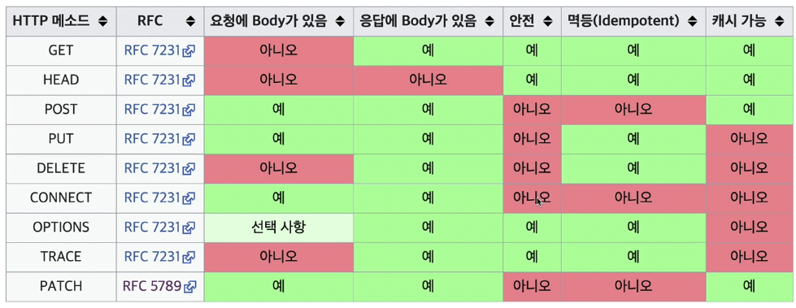

# HTTP Method

HTTP API를 만들 때 우리는 원하는 행위와 이를 행하고 싶은 리소스를 서버에 전달한다. 여기서 리소스가 무엇인지를 인식하는게 꽤 중요하다. URI와 URL의 차이는 [여기](https://auth0.com/blog/url-uri-urn-differences/)서 자세히 확인할 수 있다.

이 때 URI(Uniform Resourse Identifier)에 행위를 포함하는 것은 많은 혼란을 야기한다.따라서 우리는 이를 방지하고자 HTTP Method를 통해 행위를 전달한다.

- **GET** : 리소스 조회, 전달하고 싶은 데이터는 Query를 통해서 전달
- **POST** : 신규 리소스 등록 & 요청 데이터 처리, 메시지 바디를 통해 데이터를 전달
    - HTML Form에 입력한 정보들을 데이터 처리 프로세스에 제공
    - 게시판, 블로그 등 메시지 게시
    - 서버가 아직 식별하지 않은 새로운 리소스 생성
    - 기존 자원에 데이터 추가
- **PUT** : 리소스를 완전히 대체(덮어쓰기), 클라이언트가 이미 리소스 위치를 알고 있는 것이 POST와의 차이점
- **PATCH :** 리소스를 부분 변경
- **DELETE : 리소스 제거**

---

### HTTP 메서드의 속성

- **안전 :** 호출할 때 리소스가 변경되는지
- **멱등 :** 한번 호출하든, 두번 호출하든 여러 번 호출하든 결과가 똑같은지
    
    이 개념은 왜 필요할까? **서버가 정상 응답을 주지 못했을 때 클라이언트가 같은 요청을 다시 해도 되는가에 대한 판단 근거**로써 사용된다.
    
- **캐시 가능** : 응답 결과 리소스를 캐시해서 사용해도 되는가? 주로 GET, HEAD에 사용

---

### 데이터 전송 예시

우리는 HTTP 메서드를 사용해서 서버에게 리소스를 요청할 수 있다는 것을 확인했다. 그런데 좀더 자세하게 요청하고 싶다면 어떨까? 예를 들어 GET을 통해 게시판을 조회하고 싶은데 시간 순으로 조회하고 싶다고 가정해보자. “시간순”이라는 데이터는 어떻게 전달해야 할까?

클라이언트에서는 총 4가지 방식으로 서버에 데이터를 전송할 수 있다.

- 정적 데이터
    - 이미지, 정적 텍스트 문서
- 동적 데이터
    - 검색, 게시판 목록에서의 정렬 필터
    - GET에서 쿼리 파라미터를 통해 구체적인 정보 전달
        - 위에서 언급한 “시간순" 개념이 여기에 속한다.
- HTML Form을 통한 데이터 전송
    - POST에서 HTTP Body를 통해 데이터 전달
        - HTTP Header - Content-type → *application/x-www-form-urlencoded*
    - GET, POST만 사용 가능하다는 제약
        - 컨트롤 URI(동사로 된 리소스 경로)를 사용
        - ex. /members/{id}/delete, /members/{id}/edit
    - 회원가입, 상품 주문, 데이터 수정
- HTTP API를 통한 데이터 전송
    - 서버 → 서버, 앱, 웹 프론트엔드
    - JSON 형식으로 데이터 전송
        - HTTP Header - Content-type → *application/json*

---

### HTTP API 설계 예시

1. **회원 관리 시스템**

회원 관리 시스템은 어떻게 API를 설계해야 할까? 예시를 통해서 알아보자. 미리 핵심을 언급하자면 이 경우 리소스 관리 주체는 서버라는 점이다. 

API는 아래처럼 설계할 수 있다. 이 때 클라이언트가 요청하는 리소스는 컬렉션이다. 컬렉션은 서버가 관리하는 리소스 디렉토리(다수개의 리소스)를 의미한다. 여기서 중요한 것은 **리소스의 관리 주체가 서버**라는 것이다.

- 회원 목록 : /members → GET
- 회원 등록 : /members → POST
- 회원 조회 : /members/{id} → GET
- 회원 수정 : /members/{id} → PATCH, PUT, POST
- 회원 삭제 : /members/{id} → DELETE

2. **파일 관리 시스템**

이번엔 파일 관리 시스템이다. 어떻게 API를 설계하면 좋을까? 여기서의 리소스 관리 주체는 클라이언트다.

우선 회원 관리 시스템과는 다르게 파일을 등록하는 경우 PUT을 사용한다. PUT는 URI를 모두 알고 있어야 한다. 무엇을 수정할 지 알아야지 수정이 가능할 테니 말이다. 즉 이것은 클라이언트가 리소스 URI를 이미 알고 있다는 것을 의미한다.

회원 관리 시스템은 컬렉션을 사용해 리소스를 핸들링했지만 이번에는 다르다. 관리 주체가 클라이언트인 경우 리소스는 스토어다. 즉 스토어는 클라이언트가 관리하는 리소스 저장소를 의미한다.

- 파일 목록 : /files → GET
- 파일 조회 : /files/{filename} → GET
- 파일 등록 : /files/{filename} → PUT
- 파일 삭제 : /files/{filename} → DELETE
- 파일 대량 등록 : /files → POST