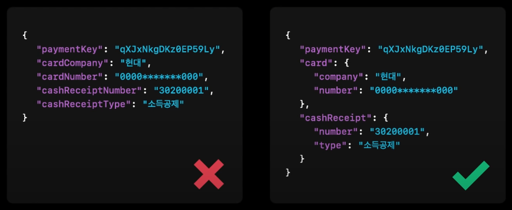
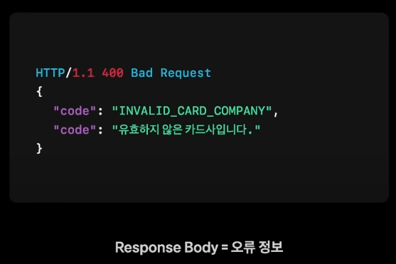

# REST Resource Naming Guide with TOSS Payment

날짜: 2021년 10월 13일
상태: refactor
유형: 작업 🔨
최종 편집일자: 2022년 6월 11일 오후 9:52

## What is a Resource?

> *Any information that can be named can be a resource*
> 

REST 내의 기본적인 데이터 표현을 **리소스** 라 칭하며, 이름을 지정할 수 있는 어떠한 정보도 리소스가 될 수 있습니다. 다만 리소스는 개념적인 매핑으로 이해해야 하며 아래와 같은 특성을 가집니다.

1. **A resources can be a singleton or a collection**
    
    리소스는 Sigleton 혹은 Collection 형태를 가질 수 있습니다. 아래는 은행 도메인의 예시입니다.
    
    - *customer* : ****Singleton resource**
    - *customers* : ****collection resource**
    
2. **A resources may contain sub-collection resources also**
    
    리소스들은 서브 컬렉션을 가질 수 있습니다. 예를 들어 *customer* 리소스는 하위 리소스로 *accounts* 리소스를 가질 수 있고, URI를 통해 계층 구조를 식별할 수 있습니다. 
    
    *ex) customers/{customerId}/accounts*
    

1. **URI (REST APIs use Uniform Resource Identifiers (URIs) to address resources)**
    
    REST API 는 URI를 통해 리소스들을 처리합니다. 따라서 **URI는 REST API가 처리해야하는 리소스** 가 됩니다. 
    

---

## Best Practices

위에서는 리소스는 무엇인가에 대해 가볍게 살펴봤습니다. 다음은 RESTful URI 에서 리소스들을 어떻게 네이밍해야하는 지에 대한 Tip 과 사례입니다.

### **Use nouns to represent resources**

```java
// GOOD
https://adventure-works.com/**orders**

// AVOID
https://adventure-works.com/**create-order**
```

Resource URI 는 동사(동작)가 아닌 **명사(리소스 자체, 사물)**를 기반으로 해야 합니다.

그렇다면 각 리소스들을 어떻게 분류하고 네이밍해야 할까요. 각 리소스들은 각 특성에 맞춰 아래의 4가지로 분류됩니다.

1. **Document (단수형)**
    
    단일 리소스를 칭합니다. 데이터베이스의 row와 같은 개념입니다. 
    
    ```java
    http://api.example.com/device-management/managed-devices/**{device-id}**
    http://api.example.com/user-management/users/**{id}**
    http://api.example.com/user-management/users/**admin**
    ```
    

1. **Collection (복수형)**
    
    서버가 관리의 주체가 되는 리소스들로 클라이언트는 이 리소스에 대해 새로운 리소스를 추가하도록 요청할 수 있지만 결정권은 서버에게 있습니다.
    
    ```java
    http://api.example.com/device-management/**managed-devices**
    http://api.example.com/user-management/**users**
    http://api.example.com/user-management/users/{id}/**accounts**
    ```
    
    이해를 위해 추가적인 설명을 덧붙이자면 예시의 *managed_devices* 리소스에 대해 클라이언트는 기기를 서버 측에 추가해달라고 요청할 수 있습니다. 하지만 이에 대한 결정권은 서버가 갖고 있기 때문에 Collection으로 분류됩니다.
    
2. **Store (복수형)**
    
    사용자에 의해 관리되는 리소스로 관리의 주체가 클라이언트입니다. 
    
    ```java
    http://api.example.com/song-management/users/{id}/playlists
    ```
    
    플레이리스트는 사용자가 주체적으로 추가, 수정, 삭제할 수 있습니다. 이때의 결정권이 **서버가 아닌 클라이언트에게 있다**는 점에서 Collection과 차이점이 있습니다.
    
3. **Controller** 
    
    실행되는 것의 개념의 경우 사용됩니다. 함수와 같은 리소스를 의미합니다. 
    
    ~~개인적으로 이 부분은 좀 애매한 듯 해서 이해가 어렵네요 😢~~
    
    ```java
    http://api.example.com/cart-management/users/{id}/cart/**checkout**
    http://api.example.com/song-management/users/{id}/playlist/**play**
    ```
    

추가적으로 리소스들은 내부적으로는 다양할 수 있지만 외부적으로 클라이언트에게는 엔터티로 표시되여야 하며, 클라이언트에게 URI를 통해 내부 구현 로직을 노출하지 않아야 합니다.

### **Consistency is the key**

1. **계층 관계는 '/'를 통해 나타냅니다.**
    
    ```java
    http://api.example.com/device-management
    http://api.example.com/device-management/managed-devices
    http://api.example.com/device-management/managed-devices/{id}
    http://api.example.com/device-management/managed-devices/{id}/scripts
    http://api.example.com/device-management/managed-devices/{id}/scripts/{id}
    ```
    
2. **URI 의 마지막에는 '/' 를 사용하지 않습니다.**
3. **언더스코어가 아닌 하이픈 문자를 사용합니다.**
4. **영문 소문자를 사용합니다.**
    
    ```java
    // 1,2 are the same but3 is not
    http://api.example.org/my-folder/my-doc  //1
    HTTP://API.EXAMPLE.ORG/my-folder/my-doc  //2
    http://api.example.org/My-Folder/my-doc  //3
    ```
    
5. **파일 확장자를 사용하지 않습니다.**
6. **CRUD function 이름을 사용하지 않습니다.**
7. **리소스들을 정렬하고 필터링하는 조건이 필요한 경우에는 Query를 이용합니다.**
    
    ```java
    http://api.example.com/device-management/managed-devices
    http://api.example.com/device-management/managed-devices?region=USA
    http://api.example.com/device-management/managed-devices?region=USA&brand=XYZ
    http://api.example.com/device-management/managed-devices?region=USA&brand=XYZ&sort=installation-date
    ```
    

---

## HTTP Method

회의 때 API의 URI(리소스)를 명사로 지정하고 이에 대한 처리는 HTTP Method (동사)로 처리해야 한다고 말씀드렸는데요. URI 와 조합되는 HTTP Method에 대한 내용입니다. 

- **GET** : 지정된 URI에서 리소스의 표현을 검색합니다. 응답 메시지의 본문은 요청된 리소스의 세부 정보를 포함합니다.
    
    *success : 200 *****
    
    *fail : 404* 
    
- **POST** : 지정된 URI 에 새로운 리소르를 생성합니다. 요청 메시지는 생성될 리소스의 세부 정보를 제공합니다.
    
    *success : 200, 201, 204*
    
    *fail :  400 (잘못된 데이터가 요청 메시지에 담김)*
    
- **PUT :** 지정된 URI 에 리소를 만들거나 대체합니다. 요청 메시지의 본문은 만들거나 업데이트하는 리소스를 지정합니다. 아마 업데이트되는 내용도 동시에 포함되는 듯 합니다.
    
    *success : 200, 201, 204*
    
    *fail :  400 (잘못된 데이터가 요청 메시지에 담김), 409 (기존 리소스 업데이트 불가, 충돌)*
    
- **DELETE :** 지정된 URI 의 리소스를 제거합니다.
    
    *success : 204*
    
    *fail :  404*
    

---

## 토스페이먼츠의 API 디자인 설계

→ [영상 참조 (06:05~17:58)](https://www.youtube.com/watch?v=E4_0WWqmF3M)

### HTTP Method? Not Pure RESTful API

RESTful 한 Design이라면 위의 HTTP Method를 사용해야하지만 `GET`,`POST` 외에는 어려움이 있어 사용하지 않고 `GET`, `POST` 만을 가지고도 다른 액션들을 처리했습니다. 

- **GET (ReadOnly):** 리소스에 상태 변화를 주지 않는 동작
- **POST (Write):** 리소스에 상태 변화를 주는 동작
    
    이 경우 결제 리소스에 대해서 승인과 취소의 상태 처리가 존재하는 경우 POST 만으로는 둘을 구분할 수 없고 충돌되게 됩니다. 
    
    *ex) POST-/payments/{paymentKey}* 결제 승인? 취소?
    

따라서 이 부분을 해결하기 위해 **Path의 마지막에 API에서 수행할 동작을 잘 표현할 수 있는 동사형 단어를 넣도록 가이드**를 정했습니다.

```java
/payment/{paymentKey}/cancel
```

### URI (Path 구조)

URI 를 통해 어떤 목적의 인터페이를 호출하는 것인지 직관적으로 파악할 수 있게 URI 컨벤션을 정했습니다. 리소스를 특정하는 고유 ID가 아닌 경우 path parameter가 아닌 Query(GET), JSON(POST) 사용했습니다.

```java
// Root path + version + 리소스 명칭  + 특정 리소스의 고유 ID값 + 행동 
https://api.toss.com/v1/payments/{paymentKey}/cancel
```

```java
// GET
?startDate=2021-01-01&endDate=2021-01-30

// POST
{
	"startDate" : "2021-01-01"
	"endDate" : "20210-01-31"
}
```

### Request & Response Body

요청&응답에 사용하는 JSON은 Nested Object를 통해 세부사항들을 계층,모듈화하여 사용했습니다.

<p align="center"></p>

같은 도메인에서 사용하는 API 에서는 최대한 같은 객체(구조가 정해진 Nested Object)들을 사용

### HTTP Status 코드

Status 코드로 오류의 종류를 파악할 수 있지만 상세한 내용을 파악하기에는 힘듭니다. 또한 토스페이먼츠에서는 고객사마다 오류를 핸들링하고자 하는 범위가 달랐구요.

따라서 HTTP Status 값이 **200**이 아니면 Response Body(영상에서는 Request Body라고 나오는데,, Request Body가 따로 영상에 나오질 않아서)의 오류 객체를 재사용하고, 메시지를 소비자에게 보여주는 방식을 사용합니다.

<p align="center"></p>

HTTP Header 에는 5가지의 Status 코드로만 전달하고
세부 내용을 Response Body의 code 프로퍼티를 통해 설명

- **사용되는 오류 코드**
    - **200** : OK
    - **400** : Bad Request
    - **401** : Unauthorized
    - **403** : Forbidden
    - **404** : Not Found
    - **500** : Internal Server Error

> **토스페이먼츠**
> 
> - [API 목록](https://docs.tosspayments.com/reference)
> - [ERROR](https://docs.tosspayments.com/reference/error-codes#api-%EC%97%90%EB%9F%AC%EC%BD%94%EB%93%9C)

---

### 참고자료

- [REST Resource Naming Guide](https://restfulapi.net/resource-naming/)
- [MS RESTful WEB API 디자인](https://docs.microsoft.com/ko-kr/azure/architecture/best-practices/api-design#use-hateoas-to-enable-navigation-to-related-resources)
- [https://bcho.tistory.com/914](https://bcho.tistory.com/914)